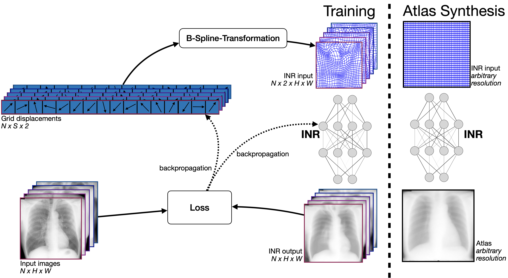

# SINA: Sharp Implicit Neural Atlases

This repository contains the code for the paper ["SINA: Sharp Implicit Neural Atlases by Joint Optimisation of Representation and Deformation"](https://link.springer.com/chapter/10.1007/978-3-031-73480-9_13) by Christoph Großbröhmer, Ziad Al-Haj Hemidi, Fenja Falta and Mattias P. Heinrich. The paper has been accepted to the WBIR workshop 2024 held in conjunction with MICCAI 2024 in Marrakech, Morocco.

## Overview

We propose SINA (Sharp Implicit Neural Atlases), a novel framework for medical image atlas synthesis, leveraging the joint optimisation of data representation and registration. By iteratively refining sample-to-atlas registrations and modelling the atlas as a continuous function in an Implicit Neural Representation (INR), we demonstrate the possibility of achieving atlas sharpness while maintaining data fidelity.



We provide visuals for JSRT and OASIS datasets. The videos show the evolution of the atlas from the initial step of the training to the final sharp atlases and are available in the `src` folder for [JSRT](./src/JSRT.mp4) and [OASIS](./src/OASIS.mp4) datasets, respectively.

## Installation

This code is implemented in Python 3.10 and depends on the following packages:

- torch
- numpy

please see the `requirements.txt` file for the full list of dependencies.

To install the required packages, create a virtual environment by running the following commands:

```bash
conda create -n sina python=3.10
conda activate sina
```

Then, install the required packages using the following command:

```bash
pip install -r requirements.txt
```

## Datasets

Datasets used in this publication can be downloaded from original sources ([JSRT](http://db.jsrt.or.jp/eng.php), [OASIS](https://github.com/adalca/medical-datasets/blob/master/neurite-oasis.md), [AbdomenCTCT](https://learn2reg.grand-challenge.org/Datasets/)).

For OASIS, we provide an exemplary script to download and prepare the dataset to a format that can be used by our training code. For this purpose, run the following command:

```bash
python prepare_OASIS.py -o .
```

Upon the acceptance of the paper, we will provide the preprocessed datasets for the JSRT and AbdomenCTCT datasets.

## Usage

To train SINA, run the following command example for 2D OASIS dataset:

```bash
python train_sina2D.py --dataset OASIS_imgs.pth 
```

Note: All other flags are already set and correspond to the results in the paper. We provided pre-trained models for all datasets, which are saved in the `pretrained_models` directory.

To synthesize an atlas, run the following command example (works for all datasets):

```bash
python synthesize.py --trained_model pretrained_models/OASIS.pth  
```

Note that the pertained 3D model is an LFS file and can be downloaded as follows:
  
  ```bash
  git lfs install
  git lfs fetch --all
  git lfs pull
  ```

## Citation

If you find this work useful, please consider citing our paper:

```
@inproceedings{anonymized_author,
  title={SINA: Sharp Implicit Neural Atlases by Joint Optimisation of Representation and Deformation},
  author={Anonymized Authors},
  booktitle={Workshop on Biomedical Image Registration, WBIR, held in conjunction with MICCAI},
  year={2024}
}
```
