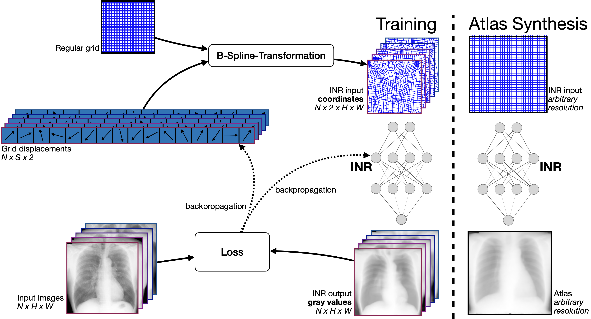

## SINA: Sharp Implicit Neural Atlases

This repository contains the code for the paper "SINA: Sharp Implicit Neural Atlases by Joint Optimisation of Representation and Deformation" by Anonymized Authors. The paper is under review at WBIR workshop 2024 held in conjunction with MICCAI 2024 in Marrakech, Morocco.

## Overview

We propose SINA (Sharp Implicit Neural Atlases), a novel framework for medical image atlas synthesis, leveraging the joint optimisation of data representation and registration. By iteratively refining sample-to-atlas registrations and modeling the atlas as a continuous function in an Implicit Neural Representation (INR), we demonstrate the possibility of achieving atlas sharpness while maintaining data fidelity.



## Installation

This code is implemented in Python 3.10 and depends on the following packages:

- torch
- Numpy
- scipy
- matplotlib
- tqdm

please see the `requirements.txt` file for the full list of dependencies.

To install the required packages, create a virtual environment and run the following command:

```bash
conda create -n sina python=3.10
```

Then, install the required packages using the following command

```bash
pip install -r requirements.txt
```

## Usage

To train the model, run the following command:

```bash
python train_sina2D.py
```

To synthesize an atlas, run the following command:

```bash
python synthesize.py
```

## Citation

If you find this work useful, please consider citing our paper:

```
@article{anonymized,
  title={SINA: Sharp Implicit Neural Atlases by Joint Optimisation of Representation and Deformation},
  author={Anonymized Authors},
  journal={Anonymized Journal},
  year={2024}
}
```
